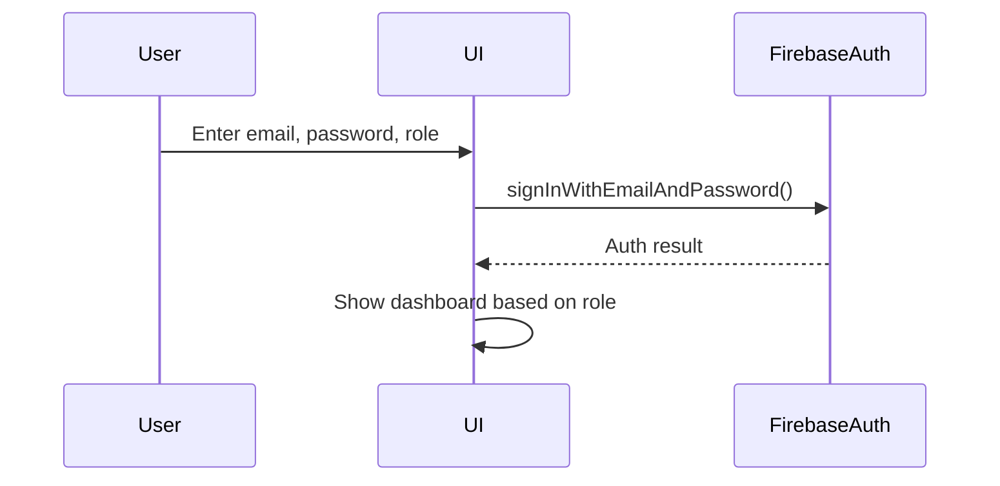
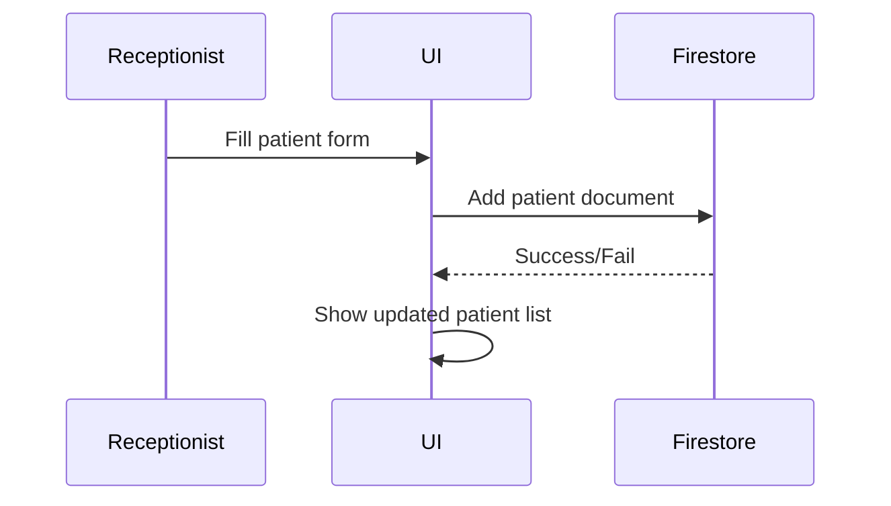
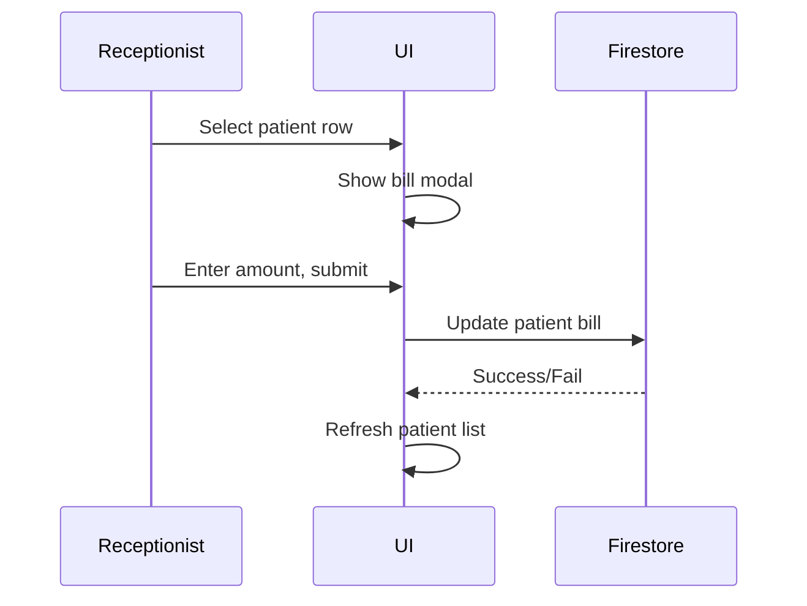
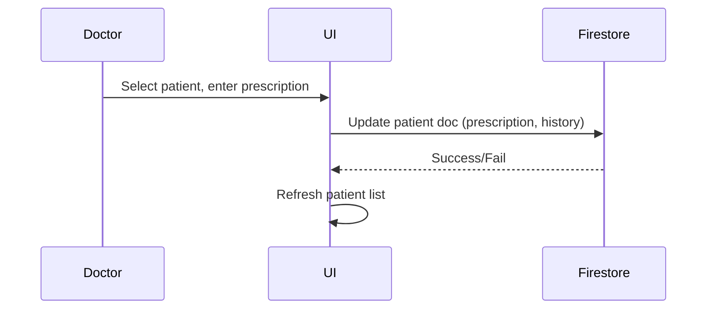
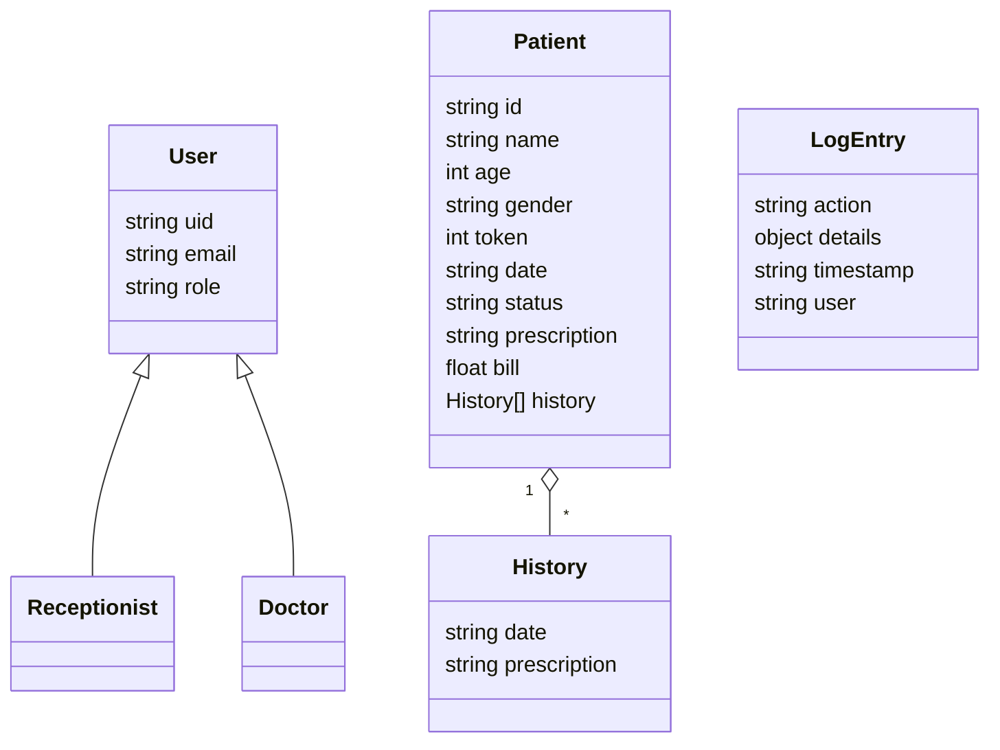

# Low Level Design (LLD) - Clinic Management System

*Describe the detailed design of each module, data flow, and interactions here.*

## Modules
- Authentication (Doctor, Receptionist)
- Token Management
- Patient Management
- Prescription Management
- Billing
- Logging

## Sequence Diagrams

### 1. Login Flow

### 2. Add Patient (Receptionist)

### 3. Generate Bill (Receptionist)

### 4. Add/Edit Prescription (Doctor)

## Class Diagrams

## Detailed Logic

### Authentication
- Uses Firebase Auth (email/password)
- On login/register, user role is checked from Firestore `users` collection
- UI updates based on role (doctor or receptionist)

### Token Management
- Each patient gets a unique token for the day
- Token = max(token) for today + 1

### Patient Management
- Receptionist adds patient (name, age, gender)
- Patient is stored in Firestore with token, date, status, and empty history
- Patient list is shown in a table, updated in real time after add

### Prescription Management
- Doctor can check a patient and add a prescription
- Doctor can edit prescription for any patient
- Each prescription is appended to the patient's history array

### Billing
- Receptionist selects a patient row to open bill modal
- Enters amount, which updates the patient's `bill` field in Firestore
- Bill info is shown in the patient list

### Logging
- All actions (login, add patient, bill, prescription, etc.) are logged to Firestore `logs` collection
- Log includes action, details, timestamp, and user
